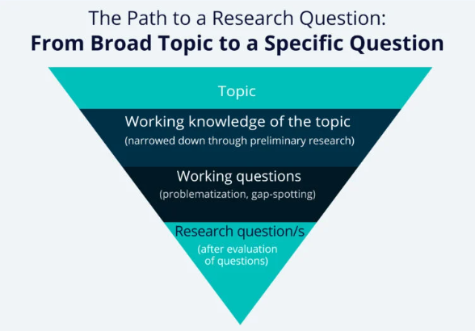
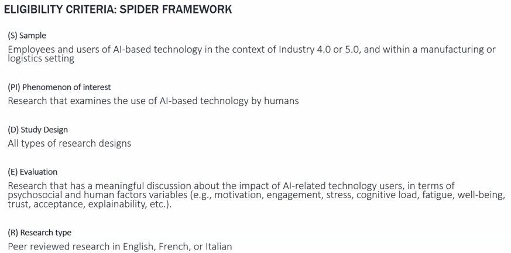
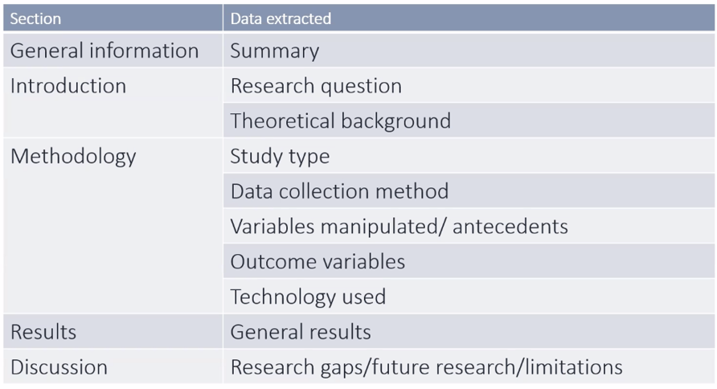
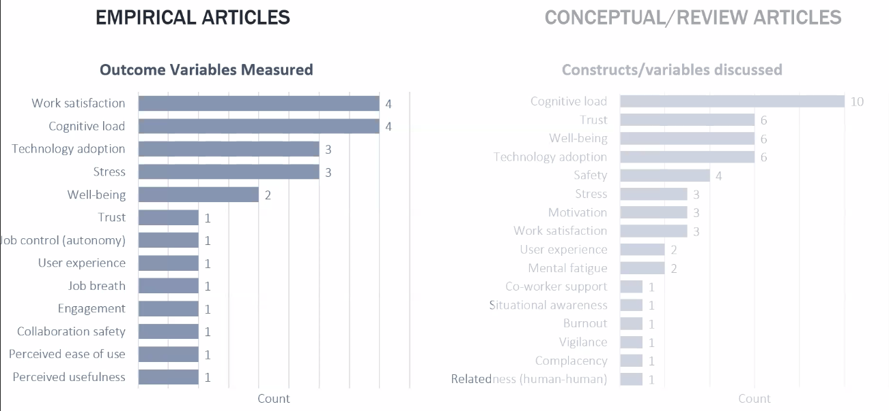
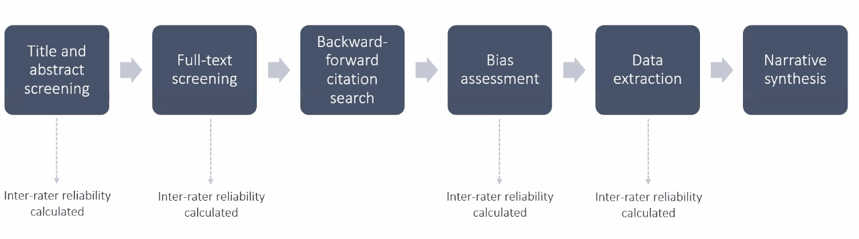
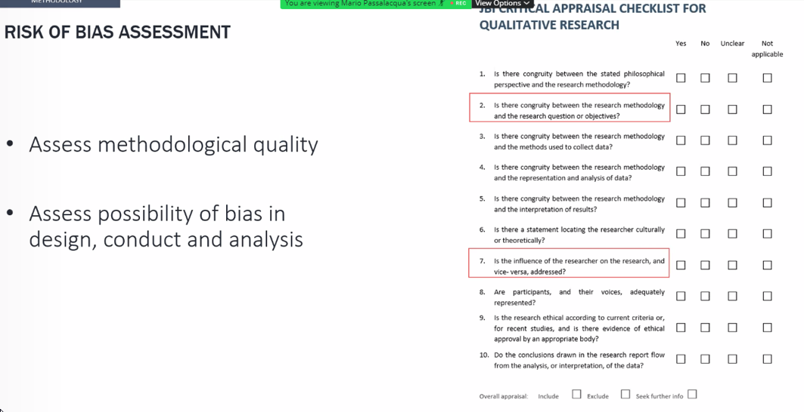
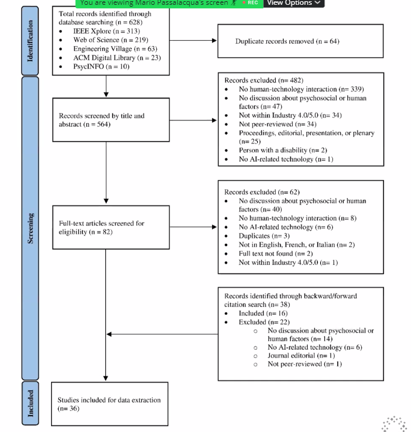
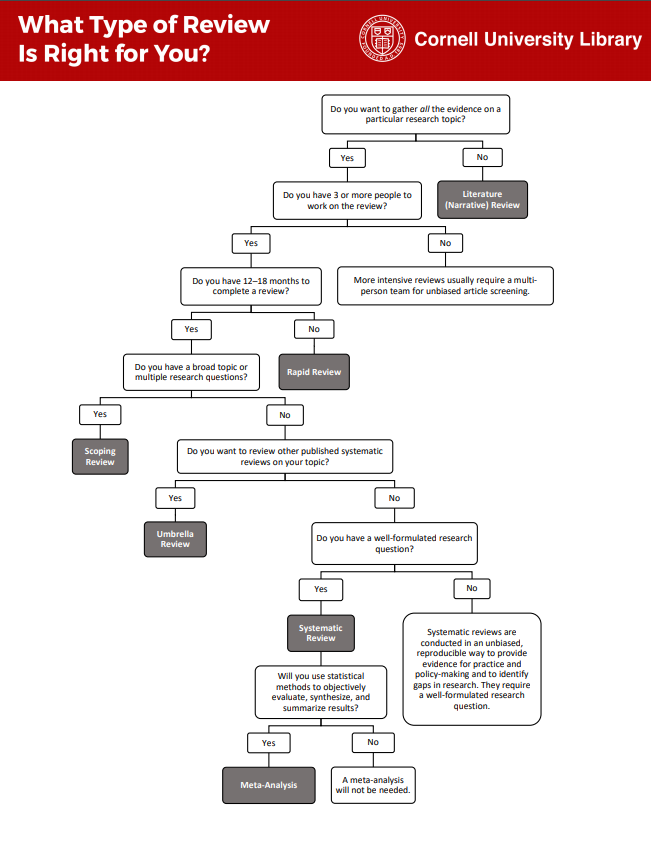

# Reviewing Review Papers
**Reviewing How to Organize and Write Review Papers** (version 0.1)

This is just some working thoughts on how to help scaffold **How to Write a Review** for students.  The following article [[**How to write a superb literature review** (Nature 2020)](https://www.nature.com/articles/d41586-020-03422-x)] talks about "*how few scientists are trained in how to write a review — or in what constitutes an excellent one*". I think there are some known methodology, techniques, and tools - but wanted to organize them for reference. Additionally, provide some example articles to understand how other researchers wrote reviews.

This paper suggests  [**Ten Simple Rules for Writing a Literature Review**](https://www.ncbi.nlm.nih.gov/pmc/articles/PMC3715443/)
* Rule 1: Define a Topic and Audience
* Rule 2: Search and Re-search the Literature
* Rule 3: Take Notes While Reading
* Rule 4: Choose the Type of Review You Wish to Write
* Rule 5: Keep the Review Focused, but Make It of Broad Interest
* Rule 6: Be Critical and Consistent
* Rule 7: Find a Logical Structure
* Rule 8: Make Use of Feedback
* Rule 9: Include Your Own Relevant Research, but Be Objective
* Rule 10: Be Up-to-Date, but Do Not Forget Older Studies

#### Examples
*Note I might have curated these paper for different reasons, such as visualization, process/methodology, rhetoric or all the above.*
* [2022 - Dabirian, Panchabikesan, Eicker - Occupant-centric urban building energy modeling Approaches, inputs, and data sources - A review](examples/2022%20-%20Dabirian%2C%20Panchabikesan%2C%20Eicker%20-%20Occupant-centric%20urban%20building%20energy%20modeling%20Approaches%2C%20inputs%2C%20and%20data%20sources%20-%20A%20review.pdf)
* [2019 - Stephanidis et al. - Seven HCI Grand Challenges - International Journal of Human-Computer Interaction](https://github.com/DesignLabUCF/ReviewingReviewPapers/raw/main/examples/2019%20-%20Stephanidis%20et%20al.%20-%20Seven%20HCI%20Grand%20Challenges%20-%20International%20Journal%20of%20Human-Computer%20Interaction.pdf)
* [2019 - Brittain, Wei - Autonomous Air Traffic Controller A Deep Multi-Agent Reinforcement Learning Approach -  Autonomous agents and multi-agent systems](https://github.com/DesignLabUCF/ReviewingReviewPapers/raw/main/examples/2019%20-%20Brittain%2C%20Wei%20-%20Autonomous%20Air%20Traffic%20Controller%20A%20Deep%20Multi-Agent%20Reinforcement%20Learning%20Approach%20-%20%20Autonomous%20agents%20and%20multi-agent%20systems.pdf)
* [2017 - van Andel, Cole, Pepping - A systematic review on perceptual-motor calibration to changes in action capabilities - Human Movement](examples/2017%20-%20van%20Andel%2C%20Cole%2C%20Pepping%20-%20A%20systematic%20review%20on%20perceptual-motor%20calibration%20to%20changes%20in%20action%20capabilities%20-%20Human%20Movement.pdf)
* [2017 - Brand, de Oliveira - Recalibration in functional perceptual-motor tasks A systematic review - Human Movement Science](examples/2017%20-%20Brand%2C%20de%20Oliveira%20-%20Recalibration%20in%20functional%20perceptual-motor%20tasks%20A%20systematic%20review%20-%20Human%20Movement%20Science.pdf)
* [2016 - Fiore, Wiltshire - Technology as teammate Examining the role of external cognition in support of team cognitive processes - Frontiers](examples/2016%20-%20Fiore%2C%20Wiltshire%20-%20Technology%20as%20teammate%20Examining%20the%20role%20of%20external%20cognition%20in%20support%20of%20team%20cognitive%20processes%20-%20Front.pdf)
* [2010 - Wildman et al. - Toward an understanding of macrocognition in teams Predicting processes in complex collaborative contexts - HFES](examples/2010%20-%20Wildman%20et%20al.%20-%20Toward%20an%20understanding%20of%20macrocognition%20in%20teams%20Predicting%20processes%20in%20complex%20collaborative%20contexts%20-%20Huma.pdf)
* [2010 - Fiore et al. - Towards an understanding of macrocognition in teams Developing and defining complex collaborative processes](examples/2010%20-%20Fiore%20et%20al.%20-%20Towards%20an%20understanding%20of%20macrocognition%20in%20teams%20Developing%20and%20defining%20complex%20collaborative%20processes%20and%20pr.pdf)
* [2019 - Tao, Wang, Li - A Visualized Analysis of Game-Based Learning Research from 2013 to 2017 - Proceedings - ICIME](examples/2019%20-%20Tao%2C%20Wang%2C%20Li%20-%20A%20Visualized%20Analysis%20of%20Game-Based%20Learning%20Research%20from%202013%20to%202017%20-%20Proceedings%20-%20International%20Joint%20Confe.pdf)
* [2019 - Nazir et al. - Big Data Visualization in Cardiology - A Systematic Review and Future Directions - IEEE Access](examples/2019%20-%20Nazir%20et%20al.%20-%20Big%20Data%20Visualization%20in%20Cardiology%20-%20A%20Systematic%20Review%20and%20Future%20Directions%20-%20IEEE%20Access.pdf)
* [2022 - Passalacqua et al. - Human-Centred AI in the Age of Industry 5 . 0 A Systematic Review Protocol - HCII](examples/2022%20-%20Passalacqua%20et%20al.%20-%20Human-Centred%20AI%20in%20the%20Age%20of%20Industry%205%20.%200%20A%20Systematic%20Review%20Protocol%20-%20HCII.pdf)

[This is a living document - please add ones you find.]

# So what do I do.

1. Determine [and write out] your Research Question and Objectives.
2. SPIDER
3. Determine Search Strategy
4. List the Data to Collect and your Expected Measures
5. Define your Procedure/Methodology
6. Do your final process diagram
7. Outline your report (use your categories to frame your argument)
8. Fill in your tables and visualizations
9. Write your review (and your data and visualizations)

### Determine your topic, research question, and objectives

All studies and research start with formulating a research question. Noting formulating a good RQ is tricky - but helps you scope and center what you are doing. Address a specific issue/problem. [Image from research.com] The primary importance of framing the research question is that it narrows down a broad topic of interest into a specific area of study (Creswell, 2014). Moreover, the [**research question**](https://research.com/research/how-to-write-a-research-question) has a domino effect on the rest of the study. These questions influence factors, such as the research methodology, sample size, data collection, and data analysis (Lipowski, 2008).

Hulley et al. (2007) suggest using a set of criteria- known as the “FINER” criteria-to find out if you have a good research question. The FINER criteria are outlined below:

**F – Feasible**
A good research question is feasible, which means that the question is well within the researcher’s ability to investigate. Researchers should be realistic about the scale of their research as well as their ability to collect data and complete the research with their skills and the resources available to them. It’s also wise to have a contingency plan in place in case problems arise.

**I – Interesting**
The ideal research question is interesting not only to the researcher but also to their peers and community. This interest boosts the researcher’s motivation to see the question answered.

**N – Novel**
Your research question should be developed to bring new insights to the field of study you are investigating. The question may confirm or extend previous findings on the topic you are researching, for instance.

**E – Ethical**
This is one of the more important considerations of making a research question. Your research question and your subsequent study must be something that review boards and the appropriate authorities will approve.

**R – Relevant**
Aside from being interesting and novel, the research question should be relevant to the scientific community and people involved in your area of study. If possible, your research question should also be relevant to the public’s interest.

**An Example RQ:** 
**[RQ1:]** How can psychosocial and human factors be leveraged to improve human-AI interaction in the context of *Industry 5.0*?
**[O1:]** Determine which psychosocial and HF outcome variables have been assessed within I4 and I5 systems
**[O2:]** Determine the design and environmental antecedents of these variables in literature.
**[O3:]** Provide human-centered guidelines for sustainable design, implementation and use of AI-based methods in I5.

Should I use [**PRISMA**](https://prisma-statement.org/), [**PRISMA**](https://prisma-statement.org/), or [**OSF- Open Science Framework**](https://osf.io/)?

PRISMA is an evidence-based minimum set of items for reporting in systematic reviews and meta-analyses. PRISMA primarily focuses on the reporting of reviews evaluating the effects of interventions, but can also be used as a basis for reporting systematic reviews with objectives other than evaluating interventions (e.g. evaluating aetiology, prevalence, diagnosis or prognosis). PROSPERO accepts registrations for systematic reviews, rapid reviews and umbrella reviews. OSF is a free and open source project management tool that supports researchers throughout their entire project lifecycle where researchers often register protocals and RQs and Hs before starting.

[**Answer**] - Maybe? Yes and No. This is a growing trend to [officially] register your RQ, objectives, Hypotheses, methodology **BEFORE** searching and coding papers. You don't want to *accidentally  p-hack* your literature review. The point is to treat the literature review as science itself - so in that sense YES, follow the scientific method - state RQs, etc first - then collect and analyze data. On the other hand, not everyone is this formal - yet - but the trend is growing towards more transparency/verification/validation and repeatability/reproducibility/replication. These approaches/processes are one way to help, but not the only way.

### Eligibility Criteria
You need to figure out what papers to include and how to include them. [**SPIDER as a framework to formulate eligibility criteria in qualitative systematic reviews**](https://spcare.bmj.com/content/early/2021/05/11/bmjspcare-2021-003161)

**S: sample**
Sample size is typically smaller in qualitative research with the data collated being richer and more detailed than quantitative data. In contrast to those from epidemiological research, findings from qualitative research are not always intended to be generalised beyond the study population.

**Pi: phenomenon of interest**
Where the aim is to better understand some certain behaviours, decisions and individual experiences, the ‘phenomenon of interest’ seems to be more appropriate for use in qualitative research and evidence synthesis, including behaviours, experiences and interventions.

**D: design**
Due to the exploratory nature of qualitative research and the smaller sample size, the use of ‘design’ is often appropriate in the SPIDER framework because the design of a study (including any supporting theoretical framework) affects the robustness of the study and its analysis. In addition, researchers also believe that introducing design may increase the recognition of qualitative studies in databases where titles and abstracts are unstructured by searching for specific types of study.

**E: evaluation**
The use of ‘evaluation’ in qualitative studies is appropriate because the findings of qualitative studies may differ from quantitative studies (eg, attitudes, views, etc) depending on the research question and contain more unobservable and subjective structures.

**R – research type**
Finally, the SPIDER framework has the added benefit of allowing researchers to search for qualitative, quantitative and mixed methods by adding a ‘research type’.

**An Example SPIDER:** 

### Determine your Information Sources / Search Strategy
Clearly state your keywords, how they map your categorization, and your search strategy. What engines [information sources] are you using ACM, IEEE, PsycInfo, Web of Science, Elsvier, Science Direct , arXiv, Scopus etc.

**An Example:** 
Keywords: Industry 4.0, Industry 5.0, smart manufacturing AND psychosocial/human factors AND AI (related items intelligent agents, AI, NN DNN) this gives you multiple searches:(Industry 4.0 AND psychosocial AND AI ; Industry 4.0 AND psychosocial AND DNN, etc.)

### Data to Collect / Expected Measures
What data are you extracted for each and every article?  How are you going to report this data - graphs, tables, stats, etc.

Is the data Objective or Subjective?
Objective: Date published, venue, # of authors, citations, cited, coding category, methodological approach ...  the basic components of the study design (e.g., population, intervention, outcome)? 
Subjective: Has the author formulated a problem/issue? Is it clearly defined? Is its significance (scope, severity, relevance) clearly established? Could the problem have been approached more effectively from another perspective?

Remember to put your categories/codings/annotation in the fields below too

I always think through what and how I'm going to measure hand in hand. An example of some bar graphs.

### Procedure
You want to map out your procedure noting how you will deal with Objective or Subjective data that your capture. If you are screening for duplicates or scoring articles - anything with any entropy (meaning information is not certain). You know the article title. You might not know if the authors reached their goal. So you have multiple coders score your papers, after you reduce the space.

### The process
Normally you summarize and report your block digram procedure with the final data from your review (usually a full page graphic like below):

---

# Helpful Tips

### Avoid Jargon (Use Definitions)
Review papers are often summarizing the field and they serve as a way to allow individuals to wade in slowly to a complex topic. So don't use complicated jargon without breaking it down to its *first principles* (and their definition). This keeps everyone on the same page using the same *mental models*.

**Mental Model** is an explanation of someone's thought process about how something works in the real world. [[**Mental Models: The Best Way to Make Intelligent Decisions**](https://fs.blog/mental-models/)]. Oddly, this term is loaded a has slightly different meanings based on (sub)field. Providing your definition and where you got it grounds your readers.

I often start by just listing all the buzz word jargony things, writing down a sentnce or three to define what I mean. Often you realize an inherint ordering *B* relys on a crisp definition of *A*. 

### (Avoid) being overly ambitious (Be Focused)
Computer Graphics is approaching 70 years? - writing a comprehensive summary of Computer Graphics would take (multiple) textbooks - its too ambitious for a review paper. You need a clear way to categorize, tag, measure, and explain papers in the review. Proper scoping your main research question and focus matter - if not one of the most crucial parts to success. 

### Take a stand
A good review paper should always make you *think*. Dr. (Paul) Wiegand noted that he often likes review papers that make him question and argue the premise. Its a fair point - that you want the review paper to make you go - yes I never thought - 'those papers could be grouped together to support *X*' or 'that framing of the prior work'. 

### Coding Scheme / Categorization  / Annotating 
Categorization and classification allow humans to organize things, objects, and ideas that exist around them and simplify their understanding of the world [[Wikipedia](https://en.wikipedia.org/wiki/Categorization)]. You can use exemplars, fuzzy sets, labels, keywords etc ... but normally you want to either cover papers in a single category or explore literature across a few categories. Once you develop your categories and scheme to classify papers - you code your papers under these conditions, sort the papers, and explain the data associated with these groupings. [Note there is a ton of literature on categorization you can leverage too, but keep it simple to start. Sort by a theory, experimental approach, or technique]. This also aids with your inclusion/exclusion criteria. Annotating refers to your mental notes about the paper - try to write 1-3 lines about what the main points of the paper is doing - both for yourself - and inevitably when you have to refer to it in your [paper, thesis, blog]. (You often reduce a paper to one or several lines if it is tangential - if its central you need to really dissect it.)

**keywords** - you have to think about what keywords you are going to use to search these categories inside your search engines.

### Tools / (Meta)Data / Organization
You want to collect the 'references', the PDFs, and the Meta-data you are categorizing and annotating the paper. The trick is to keep organized. Everyone uses two main bibliographic tools [Zotero](https://www.zotero.org/) or [Mendeley](https://www.mendeley.com/) - I use both, but use Zotero a lot more. Make a Google Drive (or Dropbox, OnedDrive, Box folder) and put your PDFs there, create a coding sheet to extract the Author, date, title, and venue - if you *work smart* [not hard] you can seed that initially from Zotero by exporting a CSV of those fields to save time.] There are many ways to make notes and annotations, some use Zotero/Mendeley's built-in features/plugins. Others create a Doc/Sheet in the folder. [Some annotate the PDF itself -though this is harder to share and scale as a warning].

Other more moderate advanced tools will include: Harzing's analysis, Vicinitas, Dimensions, Google NGram, ResearchGate, VOS Viewer, CiteSpace, BibExcel and maxQDA.

You also have to understand what engines to use e.g. ACM, IEEE,  PsycInfo, Web of Science, Elsvier, Science Direct , arXiv, Scopus etc. Noting ' No single database is likely to contain all relevant references, so supplementary search is pretty much required' [[**Defining the process to literature searching in systematic reviews: a literature review of guidance and supporting studies.**](https://bmcmedresmethodol.biomedcentral.com/articles/10.1186/s12874-018-0545-3)].

More is better, duplicate and cull - [[**Which academic search systems are suitable for systematic reviews or meta-analyses? Evaluating retrieval qualities of Google Scholar, PubMed, and 26 other resources**](https://onlinelibrary.wiley.com/doi/full/10.1002/jrsm.1378)]

### Types of review papers
the literature review must be defined by a guiding concept (e.g., your research objective, the problem or issue you are discussing, or your argumentative thesis). It is not just a descriptive list of the material available, or a set of summaries. [Taylor 2022](https://advice.writing.utoronto.ca/types-of-writing/literature-review/). There is also an article that goes into more depth but the catagories. [This also help you answer the **WHY**. Why do I want write a review article? Will your review provide significant amount of fresh information and ideas?] 

Table repoduced from: [**A typology of reviews: an analysis of 14 review types and associated methodologies.**](http://onlinelibrary.wiley.com/doi/full/10.1111/j.1471-1842.2009.00848.x)

| Review Type | Description |
| ----------- | ----------- |
| Critical review      | Aims to demonstrate writer has extensively researched literature and critically evaluated its quality. Goes beyond mere description to include degree of analysis and conceptual innovation. Typically results in hypothesis or model.       |
| Literature review   | Generic term: published materials that provide examination of recent or current literature. Can cover wide range of subjects at various levels of completeness and comprehensiveness. May include research findings.        |
| Mapping review/systematic map | Map out and categorize existing literature from which to commission further reviews and/or primary research by identifying gaps in research literature. |
| Meta-analysis | Technique that statistically combines the results of quantitative studies to provide a more precise effect of the results. |
| Overview | Generic term: summary of the [medical] literature that attempts to survey the literature and describe its characteristics. |
| Mixed studies review/mixed methods review | Refers to any combination of methods where one significant component is a literature review (usually systematic). Within a review context it refers to a combination of review approaches for example combining quantitative with qualitative research or outcome with process studies. |
| Overview |	Generic term: summary of the [medical] literature that attempts to survey the literature and describe its characteristics. |
| Qualitative systematic review/qualitative evidence synthesis	| Method for integrating or comparing the findings from qualitative studies. It looks for 'themes' or 'constructs' that lie in or across individual qualitative studies. |
| Rapid review | systematic review methods to search and critically appraise existing research. |
| Scoping review |	Preliminary assessment of potential size and scope of available research literature. Aims to identify nature and extent of research evidence (usually including ongoing research). |
| State-of-the-art review	| Tend to address more current matters in contrast to other combined retrospective and current approaches. May offer new perspectives on issue or point out area for further research. |
| Systematic review |	Seeks to systematically search for, appraise and synthesis research evidence, often adhering to guidelines on the conduct of a review.
| Systematic search and review| 	Combines strengths of critical review with a comprehensive search process. Typically addresses broad questions to produce 'best evidence synthesis'. |
| Systematized review |	Attempt to include elements of systematic review process while stopping short of systematic review. Typically conducted as postgraduate student assignment. |
| Umbrella review |	Specifically refers to review compiling evidence from multiple reviews into one accessible and usable document. Focuses on broad condition or problem for which there are competing interventions and highlights reviews that address these interventions and their results. |

# What Type of Review is Right for You?
*Generally I just like this meta-diagram.*

